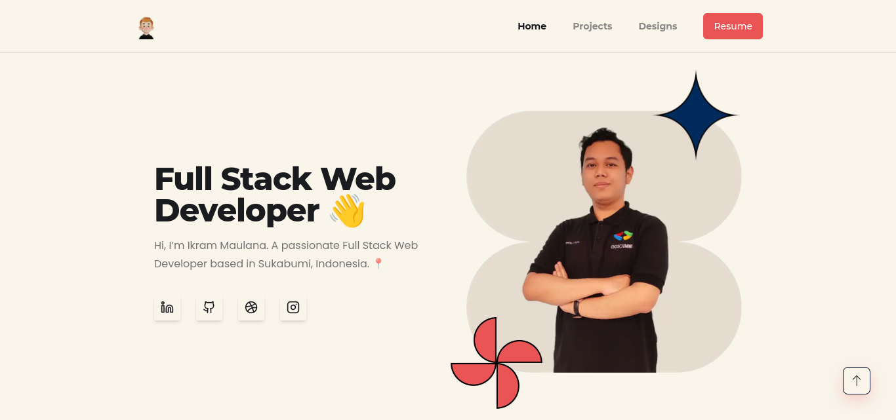

# Simple Portfolio

This is a simple portfolio website that I made using Next.js and Tailwind CSS. It is a responsive website that can be viewed on any device.

- Live example hosted on Vercel: [https://ikrammaulana.my.id](https://ikrammaulana.my.id)



## 🖥️ Running Locally

1. Clone this repository

   ```bash
   git clone https://github.com/Ikram-Maulana/neon-portfolio.git
   ```

2. Create `.env` file in root directory

   ```bash
   touch .env
   ```

3. Add your DATABASE_URL and CLOUDINARY_CLOUD_NAME to `.env` file

   ```bash
   DATABASE_URL="your_database_url"
   NEXT_PUBLIC_CLOUDINARY_CLOUD_NAME="your_cloudinary_cloud_name"
   ```

4. Install dependencies

   ```bash
   cd neon-portfolio
   npm install
   ```

5. Start the development server

   ```bash
   npm run dev
   ```

6. Open [http://localhost:3000](http://localhost:3000) with your browser to see the result

## 🚀 Deploy on Vercel

1. Fork this repository

2. Create new project on [Vercel](https://vercel.com/)

3. Connect your repository to Vercel

4. Deploy your project
